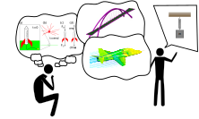

% Open Educational Resource for Scientific Computing
% Ryan C. Cooper
% September 10, 2024

# Who is Ryan Cooper
## [cooperrc.github.io](https://cooperrc.github.io)

<iframe src="https://cooperrc.github.io" width="100%" height="300" style="border:1px
solid black;">
</iframe>

# Connecting is key to learning
- [Connections through lived
  experiences](https://www.routledge.com/The-Art-of-Changing-the-Brain-Enriching-the-Practice-of-Teaching-by-Exploring-the-Biology-of-Learning/Zull/p/book/9781579220549)
  - create new neuron paths:
  - reinforcing learning
- Education is experience

# Teaching as a learning journey

# Building lived experience connections

- Instructors can scaffold connecting exercises
- Good practice for [newcomers to your field](https://firstliteracy.org/wp-content/uploads/2015/07/How-Learning-Works.pdf)
- We can't connect material to individuals' [lived experiences](https://www.taylorfrancis.com/books/mono/10.4324/9781003447313/teach-students-learn-stephanie-mcguire-saundra-yancy-mcguire-thomas-angelo)
- OER increases student [Perifanou and Economides 2022](https://doi.org/10.1080/02680513.2022.2033114)
  - autonomy
  - experimentation
  - enthusiasm
  - collaboration
- Key components in learning journey experience

# Teaching Goals: Bloom's taxonomy

<table>
<tr>
<th>Goals</th>
<th>Journey</th>
</tr>
<tr>
<td style="vertical-align:top">
- Remember: remember details and identify facts and ideas
- Compare: explanation of details
- Apply: Use skills and information to answer questions 
- Analysis: break information into parts and generalise results
- Build: create or propose something new 
- Reflect: analyze quality and validity of work
</td>
<td>

</td>
</tr>
</table>

# Identify the challenge: 
## Students wanted answers to difficult engineering problems

# How do I prepare students for difficult problems:
## build computational thinking and analysis

- Read and interpret code
- identify sources of error in a model
- Visualize data
- Use computer to integrate differential equations
- Use computer to solve sets of equations

# Needed Open Educational Resources

Myself and students:

- Autonomy in material access redistribution
- Students experiment with resources and ideas
- build working community around ideas and lessons
- continually improve resources 

# Toolset:
## [Jupyter notebooks and Jupyter-Book](https://cooperrc.github.io/computational-mechanics)

# Resources there, but...

- Spending time troubleshooting installations
- Errors from Python environments could be code or environment
- Average student doesn't need in-depth IT knowledge of environments and
  OS platforms
- Deployed Docker containers, which solved some problems, but now IT
  load was on me
- Docker containers hosted on site so access limited to current students
  
# Enter [nanoHUB/compmech](https://nanohub.org/tools/compmech)

- Jupyter environment hosted on servers with professional staff
- accounts not linked to University credentials (students always have access)
- students+instructors all have the same environments and tools
- Focus troubleshooting on computational thinking and building solutions

# Accessing [nanoHUB/compmech](https://nanohub.org/tools/compmech)

- Students create <https://nanohub.org> account
- Access to [compmech](https://nanohub.org/tools/compmech) tool is
  available through syllabus, course website, and nanoHUB website
- All changes are saved in the nanoHUB server
- Jupyter notebooks make  web, coding, and resources accessible and
  transferable
  
# Conclusions

- Using and maintaining OER for courses:
  - increases student autonomy (>700 forks to date)
  - encourages experimentation and building
  - increases community involvement (>800 discussion views and hundreds
    of view hours on YouTube)
- Any of these tools and resources can be revised+improved+distributed
  by _any_ class
- If any of this resonates, steal the tools and help to build a bigger
  OER community 

# Thanks!

## [cooperrc.github.io](https://cooperrc.github.io)

