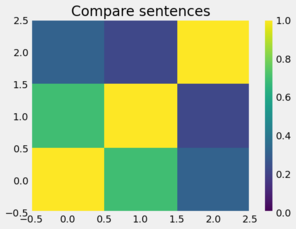

% Teaching and Learning Scientific Computing in the age of ChatGPT
% Ryan C. Cooper
% July 10, 2024

# Who is Ryan Cooper
## [cooperrc.github.io](https://cooperrc.github.io)

<iframe src="https://cooperrc.github.io" width="100%" height="300" style="border:1px
solid black;">
</iframe>

# Teaching as a learning journey


# Teaching Goals: Bloom's taxonomy

<table>
<tr>
<th>Goals</th>
<th>Journey</th>
</tr>
<tr>
<td style="vertical-align:top">
- Remember: remember details and identify facts and ideas
- Compare: explanation of details
- Apply: Use skills and information to answer questions 
- Analysis: break information into parts and generalise results
- Build: create or propose something new 
- Reflect: analyze quality and validity of work
</td>
<td>

</td>
</tr>
</table>

# Identify the challenge: strange solutions in code

- Asked to **analyze** convergence of an implicit integration method
- Given examples in readings
- Students submitted brand new, formal solutions
- Started using `fsolve` for the implicit convergence check

# Strange code submissions

<table>
<tr>
<th>Submission</th>
<th>Given function</th>
</tr>
<tr>
<td>
<pre>
import numpy as np
from scipy.optimize import fsolve

def implicit_heun_time_numpy(f, y, dt):
    """
    Approximates the solution of the differential equation 
	dy/dt = f(t, y) using Implicit Heun's method.
    """
	predictor = y + dt * f(t, y)
	
	# Define the implicit function to be solved using fsolve
	implicit_func = lambda y_next: y + (dt / 2) * (f(t, y) + f(t + dt, y_next)) - y_next
	
	# Solve the implicit function to get the corrector step using fsolve
-?> y_corrected = fsolve(implicit_func, predictor)[0]
	
    return y_corrected
</pre>
</td>
<td>

```python
def heun_step(state,rhs,dt,etol=0.000001,maxiters = 100):
    '''Update a state to the next time increment 
	using the implicit Heun's method.'''
    error = 1
    next_state = state + rhs(state)*dt
    ################### New iterative correction ###############
    for n in range(0,maxiters):
        next_state_old = next_state
        next_state = state + (rhs(state)+rhs(next_state))/2*dt
        error = np.sum(np.abs((next_state-next_state_old)/next_state)
        if error < etol:
            break
    ############### end of iterative correction ###############
    return next_state
```

</td>
</tr>
</table>

# ChatGPT was tutoring the submissions


## Is this cheating?
- Question asked for convergence, not brand new code
- Should have been cited, but there's no precedent for AI references
- Students are reading, researching, and applying information, just not
  my Creative Commons Licensed information
 
# Can a student own AI-generated work?
 
## Student is performing prompt-engineering

- Comparing course content to AI content
- Applying a solution
- Analyzing information
- Reflecting on quality and validity of the work

## Only missing piece is **building** the solution (if its completely AI-generated code)

# Who owns a monkey selfie?


# How does Naruto relate to ChatGPT?
- The macaque took the picture
- A human cannot copyright something they didn't create
- Prompt engineering is equivalent to owning the camera and setting it
  up
    - You cannot copyright anything created by AI
    - AI work is by default in the public domain

# Academic misconduct and Intellectual property

- [Plagiarism](https://www.law.cornell.edu/wex/plagiarism#:~:text=Plagiarism%20is%20the%20act%20of,United%20States%20in%20most%20situations.) is generally taking an idea or quote without
  reference
- If your academic work is not plagiarized, you _should_ be able to
  publish your work
- Publishing usually involves copyright

# Solution: If you can't copyright the work, you can't submit as your own

:format(webp)/cdn.vox-cdn.com/uploads/chorus_asset/file/24453891/zarya_of_the_dawn.jpg)

## Great except...
- You **can** copyright work that involves the use of AI, but you have
  to detail your contribution
    - [copyright guidance on AI
art](https://www.federalregister.gov/documents/2023/03/16/2023-05321/copyright-registration-guidance-works-containing-material-generated-by-artificial-intelligence#p-52)
    - [Thaler's creativity machine: AI generative art not
copyrightable](https://ecf.dcd.uscourts.gov/cgi-bin/show_public_doc?2022cv1564-24)
    - [Lindberg: Zarya of the Dawn (AI generated comic
art)](https://www.copyright.gov/docs/zarya-of-the-dawn.pdf)

# New Solution: Ask students to use AI and justify contributions

- Teaching goal _is not_ **build** the solution _from scratch_
- Teaching goals are 
    - **build** with existing and new tools
    - **compare** solutions
    - **apply** a new tool and technique
    - **reflect** on the quality of your improvements and justify your
      contributions

# Technical writing assignment to discuss ethical use of AI

## [Assignment](https://cooper-summer.github.io/AI-lesson/README.html):
  - Use prompt engineering to generate instructions on brushing teeth
  - Edit the instructions
  - Compare your edited document to the AI-generated document with
    cosine similarity of term-frequency inverse document frequency
    (TF-IDF)

## Post-process
  - Compare all 42 documents
  - Create (TF-IDF) vector for all AI and student writing
  - Calculate cosine similarity across all 21 AI and student writing
    
      
# Quick Intro: Term-frequency Inverse-Document Frequency



|   | DOCUMENT             | LOWERCASE            | CLEANING             | TOKENIZATION                      | STOP-WORDS                 | STEMMING                 |     frog |     high |     jump |    turtl |    COSIM |
|--:|----------------------|----------------------|----------------------|-----------------------------------|----------------------------|--------------------------|---------:|---------:|---------:|---------:|---------:|
| 0 | The frog jumped      | the frog jumped      | the frog jumped      | ['the', 'frog', 'jumped']         | ['frog', 'jumped']         | ['frog', 'jump']         | 0.789807 |        0 | 0.613356 |        0 |        1 |
| 1 | The frog jumped high | the frog jumped high | the frog jumped high | ['the', 'frog', 'jumped', 'high'] | ['frog', 'jumped', 'high'] | ['frog', 'jump', 'high'] | 0.547832 | 0.720333 | 0.425441 |        0 | 0.693628 |
| 2 | The turtle jumped    | the turtle jumped    | the turtle jumped    | ['the', 'turtle', 'jumped']       | ['turtle', 'jumped']       | ['turtl', 'jump']        |        0 |        0 | 0.508542 | 0.861037 | 0.311917 |

# Compare brushing teeth exercise acrross 21 students


 
# Interviews across 30 students: uses and concerns with AI
## Most students find AI useful, but worry about cheating
 

 
# Conclusions

- People are excited and scared of AI
- Great time to discuss ethics and ownership **with students**
- We're all grappling with what academic integrity and ownership means
- Set ground rules with your community
    - Detailed examples and discussions
    - Examples that show grey area between plagiarism and solo
      authorship
- Your role as an expert in your field is now **more important**
    - newcomers need examples and guidance
    - Show people how to filter, research, and revise AI outputs
    - Students become more hesitant to edit and critique when the AI
      output "sounds right"
    - Start simple and build confidence in your
      students/mentees/coworkers
    - Students need to find their voice and build experience 

# Thanks!

## [cooperrc.github.io](https://cooperrc.github.io)

<iframe src="https://cooperrc.github.io" width="100%" height="300" style="border:1px
solid black;">
</iframe>

